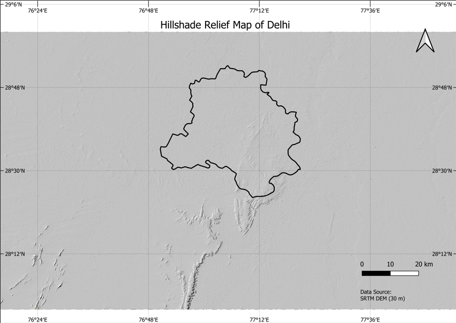
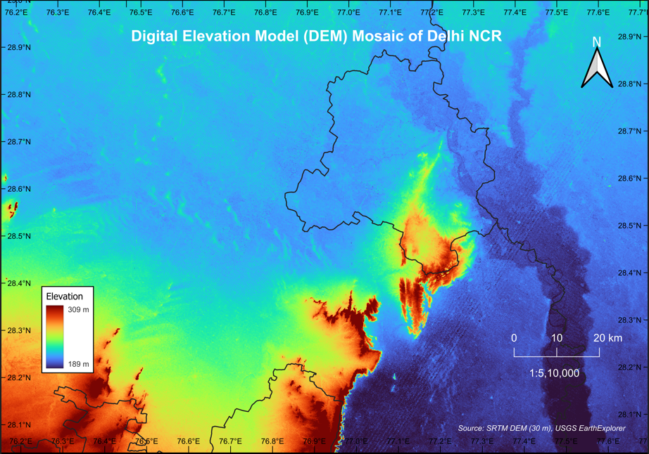
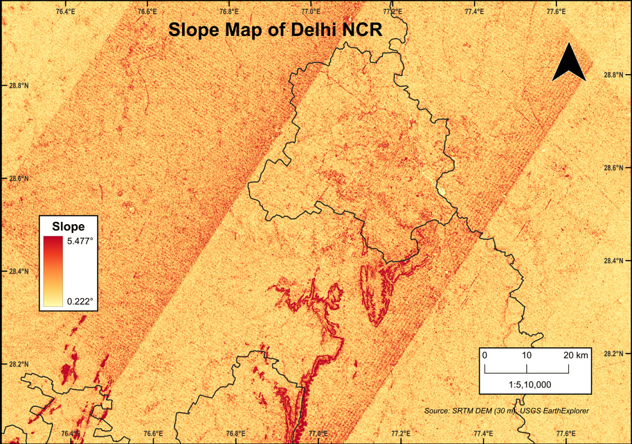
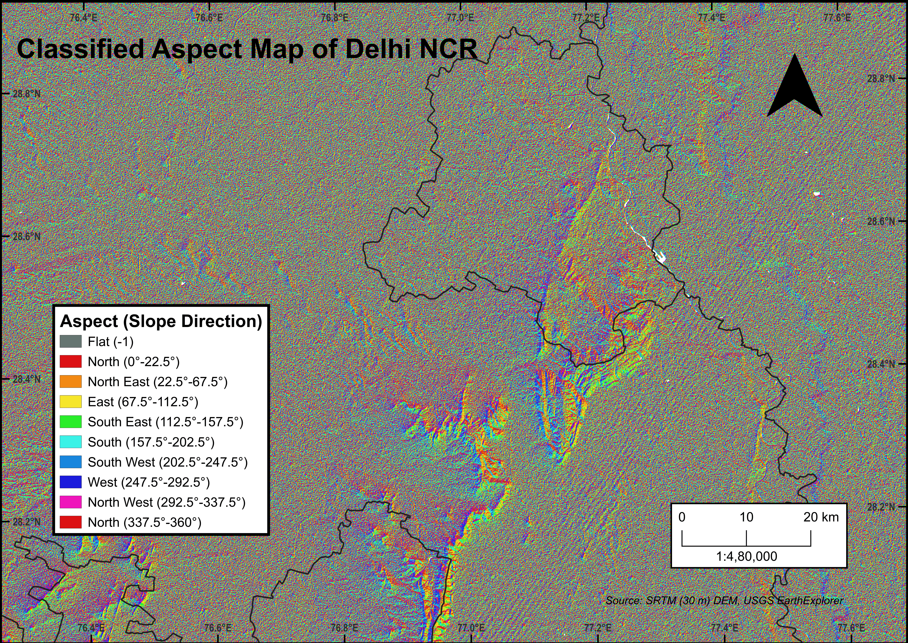
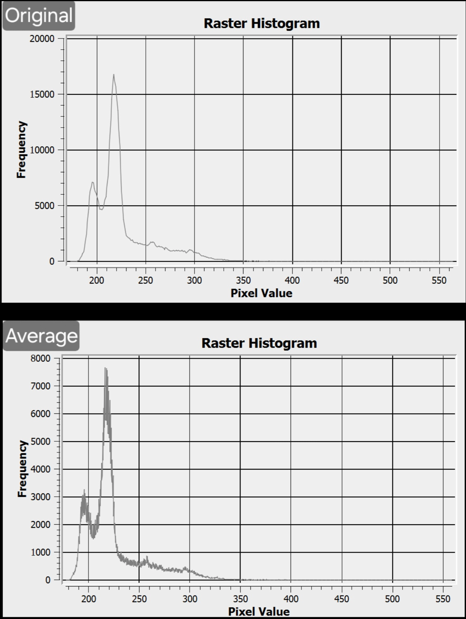

# Delhi NCR Terrain Analysis Using QGIS

## Overview

This project presents a terrain analysis of Delhi NCR using SRTM Digital Elevation Model (DEM) data and QGIS. The study involves DEM preprocessing, terrain visualization, and the generation of terrain derivatives such as Hillshade, Slope, Aspect, and Elevation maps. Additionally, histogram analysis was performed to compare the original and averaged DEM surfaces.

---

## Objectives

- Perform terrain analysis using SRTM DEM data.
- Generate Elevation, Slope, Aspect, and Hillshade maps.
- Apply DEM smoothing through averaging.
- Compare Original and Averaged DEM using histogram analysis.
- Visualize and interpret terrain characteristics of Delhi NCR.

---

## Study Area

**Delhi NCR, India**

---

## Data Used

- SRTM DEM (30 m Resolution)
- Delhi NCR Boundary Shapefile

---

## Software Used

- QGIS
- GDAL Tools

---

## Methodology

1. Acquire SRTM DEM data.
2. Import DEM into QGIS.
3. Clip DEM using Delhi NCR boundary.
4. Generate an Averaged (Smoothed) DEM.
5. Compare Original and Averaged DEM through histogram analysis.
6. Generate Elevation Map.
7. Generate Slope Map.
8. Generate Aspect Map.
9. Generate Hillshade Relief Map.
10. Design cartographic layouts and export final outputs.

---

## Outputs

### Hillshade Relief Map

### Elevation Map

### Slope Map

### Aspect Map

### DEM Histogram Comparison

---

## Key Findings

### Terrain Characteristics

- Delhi NCR is predominantly a low-relief region.
- Most of the study area consists of flat to gently sloping terrain.
- The Delhi Ridge is the most prominent terrain feature visible in the analysis.
- Southwestern portions of the region show influence from the Aravalli hill system.
- Elevation variation across the study area is relatively low.

### Hillshade Analysis

- Hillshade effectively highlights terrain morphology.
- Ridges and subtle elevation variations become more visible compared to the raw DEM.
- Terrain visualization is enhanced through simulated illumination.

### Slope Analysis

- Low slope values dominate most parts of Delhi NCR.
- Higher slope values are concentrated around ridge and elevated regions.
- Urban areas are primarily located on gently sloping terrain.

### Aspect Analysis

- Aspect varies according to local terrain orientation.
- Elevated regions exhibit more distinct directional slope characteristics.
- Aspect information can support environmental and land suitability studies.

### DEM Histogram Comparison

- The averaged DEM exhibits a smoother elevation distribution than the original DEM.
- Small-scale elevation noise is reduced after averaging.
- Major terrain characteristics remain preserved despite smoothing.
- Extreme elevation values become less pronounced in the averaged DEM.
- The averaging process improves surface continuity while maintaining overall terrain structure.
- Histogram analysis demonstrates the effect of raster filtering on DEM quality and terrain representation.

---

## Applications

- Urban Planning
- Infrastructure Development
- Watershed Analysis
- Environmental Studies
- Land Suitability Assessment
- Disaster Management
- Geospatial Decision Making

---

## Conclusion

The project demonstrates the application of DEM-based terrain analysis techniques in QGIS. Through preprocessing, visualization, and terrain derivative generation, the study provides insights into the topographic characteristics of Delhi NCR. The results highlight the predominantly flat nature of the region while identifying significant terrain features such as the Delhi Ridge and Aravalli influences.

---

## Skills Demonstrated

- Geographic Information Systems (GIS)
- Remote Sensing
- QGIS
- DEM Processing
- Terrain Analysis
- Raster Analysis
- Raster Filtering
- DEM Smoothing
- Histogram Analysis
- Spatial Analysis
- Cartography
- Geospatial Visualization

---

## Author

**Siddharth Gupta**  
B.Tech Geoinformatics  
Netaji Subhas University of Technology (NSUT)
